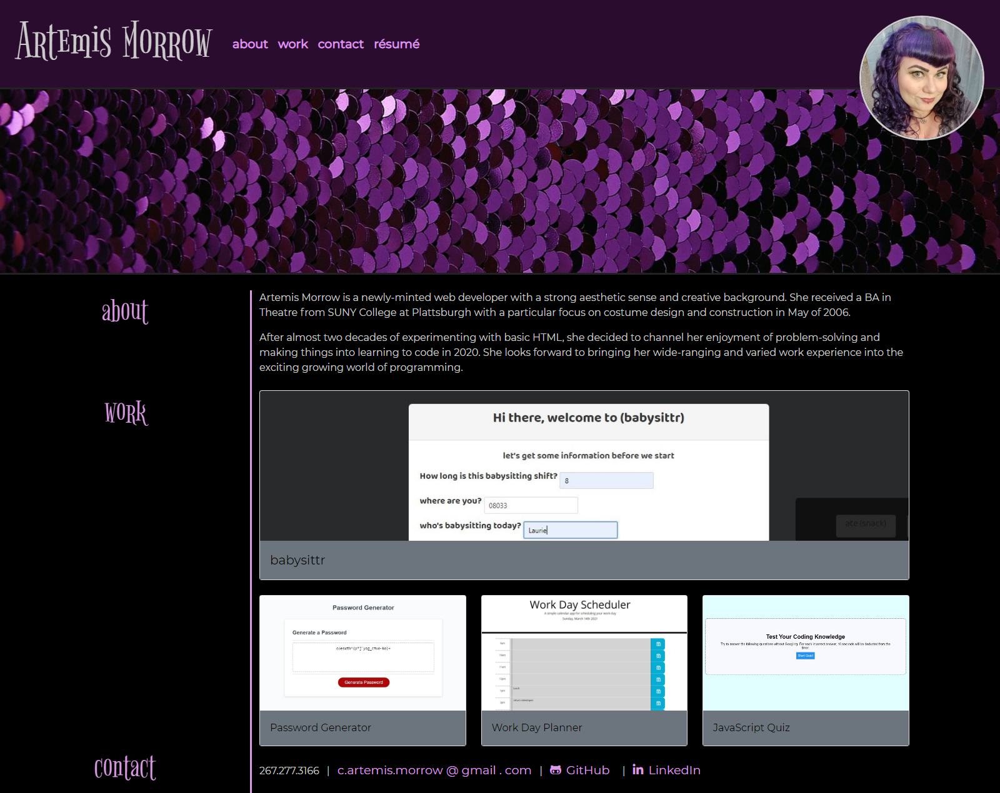
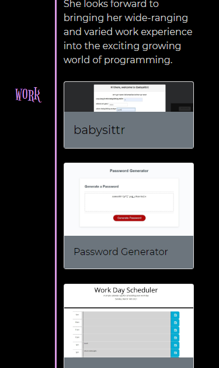

# Portfolio
portfolio v. 2

Portfolio upgraded! New, improved version includes:
- First group project added to "work" section
- Replaced lorem ipsum with actual bio
- Resume link is live and functioning, links to a slick new resume in PDF format
- Each "work" card can be clicked to open up a modal with larger screenshots, one-sentence description of the project, and links to both the deployed page and the GitHub repo
- More responsive layout, looks good even on mobile
- Some styling help from Bootstrap and Font Awesome

https://artemissorrow.github.io/portfolio-part-deux/

